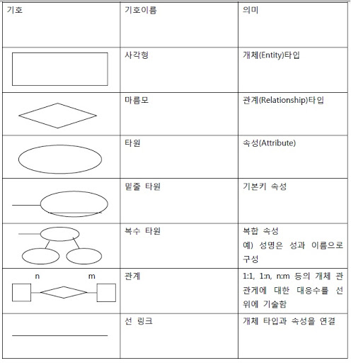

# 논리 데이터 베이스 설계

## 1. 데이터 베이스 설계

### 데이터 베이스 설계 순서

요구 조건 분석 -> 개념적 설계 -> 논리적 설계 -> 물리적 설계 -> 구현

- 개념적 설계(정보 모델링, 개념화)

  개념스키마 모델링 + 트랜잭션 모델링 병행 수행

  E-R 다이어그램 작성

  DBMS에 독립적인 개념 스키마 설계

- 논리적 설계(데이터 모델링)

  데이터 타입과 타입들 간의 관계로 표현된느 논리적 구조의 데이터로 모델화

  개념스키마를 평가 및 정제하고, DBMS에 따라 서로 다른 논리적 스키마를 설계

  트랜잭션의 인터페이스 설계

  테이블 설계

- 물리적 설계(데이터 구조화)

  데이터베이스 파일의 저장 구조 및 액세스 경로 결정

  저장 레코드의 형식, 순서, 접근 경로ㅘ 같은 정보를 사용해서 데이터가 컴퓨터에 저장되는 방법을 묘사

## 2. 데이터 모델의 구성 요소

### 1) 개체

- 개체는 데이터베이스에 표현하려는 것으로, 사람이 생각하는 개념이나 정보 단위 같은 현실 세계의 대상체
- 영속적으로 존재하는 개체의 집합
- 독립적으로 존재하거나 그 자체로서도 구별이 가능
- 유일한 식별자에 의해 식별이 가능
- 업무 프로세스에 이용된다.
- 다른 개체와 하나 이상의 관계가 있다.

### 2) 속성

- 데이터 베이스를 구성하는 가자 작은 논리적 단위
- 파일 구조상의 데이터 항목 또는 데이터 필드에 해당
- 속성은 개체를 구성하는 항목
- 개체의 특성을 기술
- Degree: 속성의 수, 차수라고도 함

### 3) 관계

- 개체와 개체 사이의 논리적인 연결
- 일대일, 일대다, 다대다 관계가 있음
- 종류: 종속관계, 중복 관계, 재귀관계, 배타관계

## 3. E-R 모델

- 1976년 피터첸에 의해 제안되고 기본적인 구성 요소가 정립
- 개체와 개체 간의 관계를 기본 요소로 이용하여, 현실 세계의 무질서한 데이터를 개념적인 논리데이터로 표현하기 위한 방법으로 사용됨
- 개체타입과 관계타입을 이용해 현실세계를 개념적으로 표현

- 데이터를 개체, 관계, 속성으로 묘사

- 피터첸 모델

  

### 4) 정규화

> 정규화란? 함수의 종속성 등의 종속성 이용을 이용하여 잘못 설계된 관계형 스키마를 더 작은 속성의 세트로 쪼개어 바람직한 스키마로 만들어가는 과정

- 정규화의 목적
  - 데이터 구조의 안정성과 무결성을 유지
  - 효과적인 검색 알고리즘을 생성
  - 데이터 중복을 배제하여 이상의 발생 방지 미 자료 저장 공간의 최소화가 가능
  - 데이터 모형의 단순화
  - 속성의 배열 상태 검증 가능
  - 개체와 속성의 누락 여부확인 가능
  - 자료 검색과 추출의 효율성 추구

- 이상(Anomaly)

  정규화를 거치지 않으면 데이터베이스 내에 데이터들이 불필요하게 중복되어 릴레이션 조작 시 예기치 못한 곤란한 현상이 발생하는데, 이를 이상이라한다.

  - 삽입이상
  - 삭제이상
  - 갱신이상

- 정규화 과정

  - 1NF

    릴레이션이 속한 모든 도메인이 원자값으로만 되어있는 정규형

    릴레이션의 모든 속성값이 원자 값으로만 되어 있는 정규형

  - 2NF

    기본키가 아닌 속성이 기본키에 대하여 완전 함수적 종속을 만족하는 정규형

  - 3NF

    기본키가 아닌 모든 속성이 기본키에 대해 이행적 종속을 만족하지 않는 정규형

    무손실 조인 또는 종속성 보존을 저해하지 않고도 항상 3NF 설계를 얻을 수 있다.

  - BCNF

    결정자가 보두 후보키인 정규형

    강한 제3정규형이라고도 함

  - 4NF

    다치종속이 성립하는 경우 모든 속성이 함수적 종속관계를 만족하는 정규형

  - 5NF

    모든 조인 종속이 R의 후보키를 통해서만 성립되는 정규형 