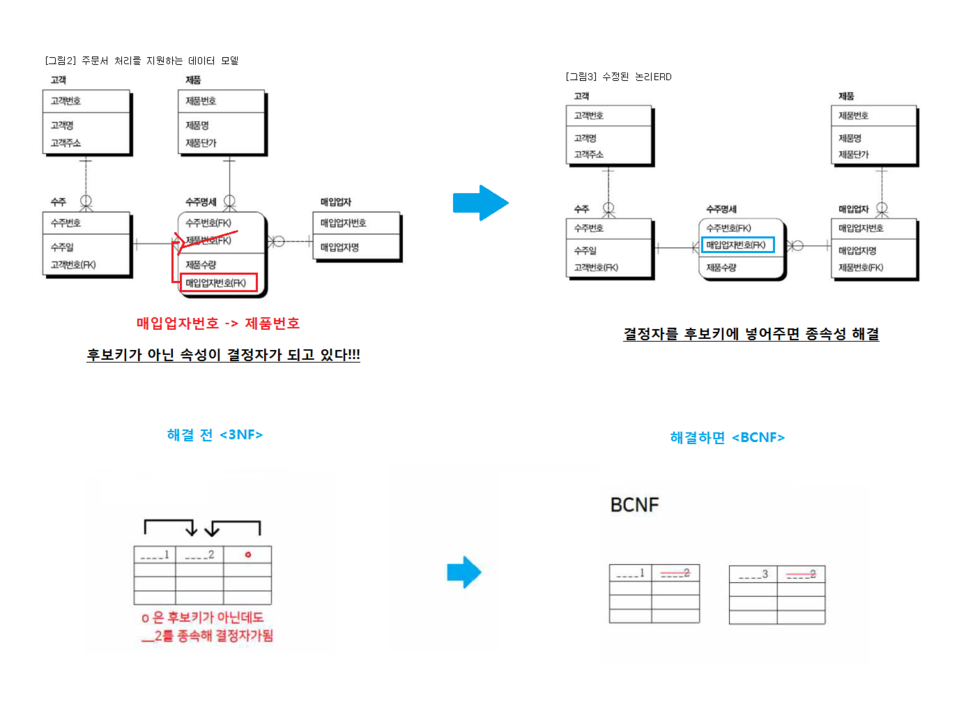

# 정보처리기사 실기 기출

| 2018년 2회 | CREATE ALTER DROP SELECT UPDATE INSERT DELETE GRANT REVOKE COMMIT ROLLBACK |                                                              |
| ---------- | ------------------------------------------------------------ | ------------------------------------------------------------ |
| 2018년1회  | SELECT 학번, 이름 FROM 학생 WHERE 학년 IN (3,4);             | 하위질의 -단일값 : = or IN   둘다 사용가능 -다중값 : IN 만 사용가능 |
| 2017년3회  | CREATE TABLE 고객 { 아이디 CHAR(20),  이름 CHAR(10),  나이 INT,  등급 CHAR(10),  포인트 INT, PRIMARY KEY(아이디), FOREIGN KEY(이름) REFERENCES 주문(고객이름), FOREIGN KEY(등급) REFERENCES 제품(제품등급) } ; |                                                              |
| 2017년2회  | DELETE FROM 사원 WHERE 이름 = 'scott';                       |                                                              |
| 2017년1회  | INSERT INTO 학생  Values(98170823, '한국산', 3, '경영학개론', '?-1234-1234'); |                                                              |
| 공개문제   | SELECT S_EMP.NAME, S_EMP.DEPT_ID, S_DEPT.DEPT_NAME        FROM S_DEPT, S_EMP WHERE S_DEPT.DEPT_ID = S_EMP.DEPT_ID ORDER BY S_EMP.AGE; |                                                              |

| 2017                                       | 출제 리스트                                                  | 설명                                                         |
| ------------------------------------------ | ------------------------------------------------------------ | ------------------------------------------------------------ |
| 1회                                        | CASCADE                                                      | DROP, DELETE, UPDATE 의 옵션으로 테이블 혹은 튜플을 연쇄적으로 수정/삭제 하는 명령 키워드 |
| Drill Down (= Roll Down)                   | 분석할 항목에 대해 한 차원의 계층구조를 따라 단계적으로 요약된 형태의 데이터로부터 구제적인 상세 데이터로 접근하는 기능 |                                                              |
| Pivoting                                   | 보고서의 행, 열, 페이지 차원을 바꾸어 볼 수 있는 기능        |                                                              |
| 트랜잭션 특징 -A,C,I,D                     | Atomicity (원자성) : 모두 반영되거나 아니면 전혀 반영되지 아니어야 된다. Consistency (일관성) : 트랜잭션이 그 실행을 성공적으로 완료하면 언제나 일관서 있게 DB 상태를 변환 Isolation (독립성,격리성) : 둘 이상의 트랜잭션이 병행 실행 중일 때, 다른 트랜잭션 연산이 끼어들수 없다 Durability (영속성,지속성) : 트랜잭션의 결과는 영구적으로 반영 |                                                              |
| Trigger                                    | 특정 테이블의 데이터에 변경이 가해졌을 때 연쇄적으 로 수행되는 저장 함수라고 할 수 있다 |                                                              |
| SQL (INSERT INTO)                          | INSERT INTO 학생 Values(98170823, '한국산', 3, '경영학개론', '?-1234-1234'); |                                                              |
| 2회                                        | 이상현상 (Anomaly)                                           | 데이터베이스 설계 시 데이터의 중복과 종속으로 인해 발생되는 문제점 발생원인: 이상현상의 발생 원인은 릴레이션에서 일부 속성들의 종속으로 인해 데이터의 중복이 발생하기 때문이다. 종류 : 삽입(INSERT)이상, 삭제(DELETE)이상, 갱신(UPDATE)이상 |
| 데이터베이스 설계 순서                     | 요구사항분석  => 개념적 설계 => 논리적 설계 => 물리적 설계 => 구현 |                                                              |
| COMMIT                                     | 트랜잭션이 성공했을 경우 그 결과를 DB에 적용하여 완료시키는 명령 |                                                              |
| 메타데이터 (Metadata)                      | 데이터에 관한 구조화된 데이터로, 다른 데이터를 설명해주는 데이터. 시스템 카탈로그에 저장되어 있다. |                                                              |
| MDR (Metadata Registry, 메타데이터 등록소) | 메타데이터의 등록과 인증을 통하여 메타데이터를 유지 ㆍ관리하며, 메타데이터의 명세를 공유하는 레지스트리. |                                                              |
| SQL (DELETE)                               | DELETE FROM 사원 WHERE 이름 = 'scott';                       |                                                              |
| 3회                                        | ÷ (DIVISION)                                                 | A, B 릴레이션에서 B릴레이션 조건에 만족하는 열만 프로젝션 하는 것 |
| 데이터마이닝                               | [인공 지능](http://terms.tta.or.kr/dictionary/dictionaryView.do?subject=인공+지능) 기법을 이용하여 대용량의 데이터에서 의미 있는 통계적 패턴이나 규칙, 관계를 찾아내 분석함으로써 유용하고 활용 가능한 정보를 추출하는 기술. |                                                              |
| 군집화                                     | 서로 유사한 정도에 따라 다수의 객체를 군집으로 나누는 작업 또는 이에 기반한 분석. |                                                              |
| 병행제어                                   | 동시에 여러 개 수행할 때, 데이터베이스 일관성 유지를 위해 트랜잭션 간의 상호 작용을 제어 |                                                              |
| 로킹기법 (Locking)                         | 하나의 트랜잭션이 데이터를 액세스하는 동안 다른 트 랜잭션이 그 데이터 항목을 액세스할 수 없도록 하는 방법 |                                                              |
| 비정규화(denormalization)                  | 시스템의 성능 향상을 위해서 정규화에 위배되는 행위를 하는 것. |                                                              |
| SQL (CREATE)                               | NOT NULL, 0, PRIMARY, FOREIGN, REFERENCES                    |                                                              |

| 2016           | 출제 리스트                                                  | 설명                                                         |
| -------------- | ------------------------------------------------------------ | ------------------------------------------------------------ |
| 1회            | 관리기법/1                                                   |                                                              |
| 제약조건       | 데이터베이스에 저장되는 데이터의 정확성을 보장해주기 위하여 키를 이용하여 입력되는 데이터에 제한을 주는 것 (개체 무결성 제약조건) : 릴레이션의 기본키를 구성하는 어떠한 속성도 NULL 값이나 중복값이 될 수 없다  (참조 무결성 제약조건) : 릴레이션은 참조할 수 없는 외래키 값을 가질 수 없다                     (A테이블이 B테이블을 참조할 때, A테이블의 외래키=B테이블의 기본키) |                                                              |
| REFERENCES     | FOREIGN KEY ~ REFERENCES 외래키 지정, 참조 테이블 지정 키워드 |                                                              |
| CASCADE        | 원본(부모)테비을을 삭제/수정하면 참조(자식)테이블도 연쇄적으로 삭제/수정시키는 옵션 키워드 |                                                              |
| RESTRICT       | 삭제/수정을 하는데, 관련된 참조테이블이 있으면 삭제/수정을 하지 않도록 하는 옵션 키워드 |                                                              |
| 2회            | Meta Data                                                    | 다른 데이터의 속성정보와 관계를 설명해주는 데이터로 시스템 카탈로그에 저장되어 있다 |
| Data Warehouse | 다량의 데이터를 효과적으로 분석하여 정보화하고 이를 여러 계층의 사용자들이 효율적으로 사용할 수 있도록한 데이터베이스 이다. |                                                              |
| 다차원         | Data warehouse 는 (다차원) 데이터베이스이다                  |                                                              |
| OLAP           | OLAP : 사용자가 DB 검색/분석을 통해 문제해결을 찾도록 해주는 분석형 어플리케이션 cf) MOLAP : 결과를 다차원 배열로 저장하여 큐브 형태의 데이터 뷰로 다양한 분석을 할 수 있도로 지원하는           다차원 DB 기반 OLAP  (Multidimensional OLAP) ROLAP : 질의 처리 시간을 줄이기 위해 집계 테이블을 생성/저장하여 두는 시스템으로           관계형 DB 기반 OLAP 구조 (Relational OLAP) HOLAP : 다차원 DB + 관계형 DB 함께 쓸 수 있도록 MOLAP과 ROLAP 의 장점을 혼용한 시스템        (Hybrid OLAP) |                                                              |
| Data Mining    | 대량의 데이터로부터 실존하지 않는 정보를 얻어내기 위해 AI 기법 등으로 통계규칙이나 패턴을 찾는 것 |                                                              |
| 3회            | Trigger                                                      | 트리거가 어떤 이벤트가 발생했을 때 조건이 참이 되면 트리거와 연관된 동작이 수행되고,  그렇지 않으면 아무 동작도 수행되지 않음. |
| Event (이벤트) | 데이터베이스의 항목을 변경시키는 일의 발생                   |                                                              |
| MAX            | 그룹함수(복수행함수)  : 하나 이상의 행을 그룹을 묶어 연산하여, 하나의 결과를 나타내는 함수 SUM  : 해당 속성에 대한 튜플의 값들의 총합을 구하는 함수 AVG  : 해당 속성에 대한 튜플의 평균을 구하는 함수 MAX  : 지정한 튜플 값들 중에서 최댓값을 구하는 함수 MIN  : 지정한 튜플 값들 중에서 최솟값을 구하는 함수 COUNT :  릴레이션에서 해당 조건을 만족하는 해우이의 개수를 반환하는 함수 GROUP BY ~ HAVING 절  : 특정 속성을 기준으로 릴레이션에 조재하는 행들을 그룹별로 구분하기 위해 사용 |                                                              |
| 선분           | 시점 이력관리 : 데이터의 변경이 발생한 시각만 관리 선분 이력관리 : 데이터 변경의 시작 시점부터 그 상태의 종료 시점까지 관리 |                                                              |
| 변경           | 변경 이력 데이터 : 관리하고 있는 데이터의 변경 전후를 모두 관리할 수 있도록 구성한 데이터 발생 이력 데이터 : 시간에 따라서 발생하는 데이터를 모두 관리할 쉬 있도로 구성한 데이터  진행 이력 데이터 : 업무가 진행되는 상태를 모두 관리할 수 있도록 구성한 데이터 |                                                              |
| SQL            | SELECT 주문번호, 주문수량 FROM 주문변경 WHERE 사업부코드 = "1234" AND 변경일자 = MAX; |                                                              |

| 2015                                              | 출제 리스트                                                  | 설명                                                         |
| ------------------------------------------------- | ------------------------------------------------------------ | ------------------------------------------------------------ |
| 1회                                               | Big Data                                                     | 기존의 관리 방법이나 분석 체계로는 처리하기 어려운 막대한 양의 정형 또는 비정형 데이터 집합. |
| DSMS (Data Stream Management System)              | 실시간으로 발생하는 대용량 [데이터 스트림](http://terms.tta.or.kr/dictionary/dictionaryView.do?subject=데이터+스트림)을 효율 있게 관리하려고 정형화된 [데이터 스트림](http://terms.tta.or.kr/dictionary/dictionaryView.do?subject=데이터+스트림)을 관리하는 시스템 |                                                              |
| Anomaly                                           | 데이터베이스 설계 시 데이터의 중복과 종속으로 인해 발생되는 문제점 발생원인: 이상현상의 발생 원인은 릴레이션에서 일부 속성들의 종속으로 인해 데이터의 중복이 발생하기 때문이다. 종류 : 삽입(INSERT)이상, 삭제(DELETE)이상, 갱신(UPDATE)이상 |                                                              |
| 부분함수종속                                      | 도.부.이.결.다.조                                            |                                                              |
| 2NF                                               | 도.부.이.결.다.조                                            |                                                              |
| A->C                                              | [함수적 종속] A가 C를 함수적으로 종속한다고 할 때 표기법 : A -> C A : 결정자 C : 종속자 |                                                              |
| 2회                                               | Tunning (데이터베이스 튜닝)                                  | 데이터베이스의 비효율적인 요소를 제거하고, 여러요소를 조정(최적화)하는 작업 |
| Locking                                           | 하나의 트랜잭션이 동작할 때, 다른 트랜잭션이 그 데이터 항목을 액세스할 수 없도록 하는 방법 |                                                              |
| Selectivity                                       |                                                              |                                                              |
| Clusterd (INDEX)                                  | 물리적으로 테이블의 데이터를 재배열  : 데이터의 삽입순서와 상관없이 인덱스로 생성되어 있는 컬럼을 기준으로 정렬되어 삽입된다. |                                                              |
| Non-clustered (INDEX)                             | 물리적으로 데이터를 배열하지 않은 상태로 데이터 페이지가 구성 중간 레벨 인덱스 페이지들을 생성하고, 이 인덱스 페이지를 찾기위한 루트 레벨 인덱스 페이지를 생성 |                                                              |
| 3회                                               | Shared Data                                                  | <데이터베이스 정의> Intergrated Data (통합된 데이터) : 중복을 최소화한 데이터의 모임 Stored Data (저장된 데이터) : 저장매채에 저장된 데이터 Operational Data (운영 데이터) : Shared Data (공유 데이터) : 여러 사용자들이 정보를 공동으로 이용할 수 있도록 한 데이터 |
| Continusous Evolution                             | <데이터베이스 특징> Concurrent Sharing (동시공유)  Continuous Evolution (계속적이 변화) Real-Time Accessibility (실시간 접근성) Contents Reference (내용에 의한 참조) |                                                              |
| MARC (Machine Readable Cataloging, 기계가독 목록) | 서지 자료 및 관련 정보를 컴퓨터용 양식으로 교환ㆍ저장하는데 사용되는 부호화 포맷. (컴퓨터가 목록를 식별하여 축적·유통할 수 있도록 코드화한 일련의 메타데이터 표준 형식) |                                                              |
| 상호운용성                                        | [메타데이터 구축 데이터포맷] : MARC, DC, ONIX, MODS MARC : 컴퓨터가 목록를 식별하여 축적·유통할 수 있도록 코드화한 일련의 메타데이터 표준 형식 DC : 네트워크 환경에서 각종 전자 정보를 기술하는 핵심적인 데이터 요소 ONIX : 유통에 관한 통계와 체계적인 정보를 취급함으로써 정상적인 유통 및 관리를 하기 위해 개발 MODS : 상호운용성, 정밀성을 모두 만족시킨 디지털 도서관의 범용 서지정보 표준 메타데이터로서          디지털 도서관의 요구에 가장 부합되는 특성 |                                                              |
| MDR (MetaData Registry, 데이터 등록소)            | 메타데이터의 등록과 인증을 통해서 메타데이터를 유지관리하는 레지스트리 |                                                              |

| 2014                               | 출제 리스트                                                  | 설명                                                         |
| ---------------------------------- | ------------------------------------------------------------ | ------------------------------------------------------------ |
| 1회                                | Meta Data  (메타 데이터)                                     | 데이터에 관한 구조화된 데이터로, 다른 데이터를 설명해주는 데이터. 시스템 카탈로그에 저장되어 있다. |
| Data warehouse (데이터 웨어하우스) | 다량의 데이터를 효과적으로 분석하여 정보화하고 이를 여러 계층의 사용자들이 효율적으로 사용할 수 있도록한 데이터베이스 이다. |                                                              |
| 다차원                             | Data warehouse 는 (다차원) 데이터베이스이다                  |                                                              |
| OLAP                               | OLAP : 사용자가 DB 검색/분석을 통해 문제해결을 찾도록 해주는 분석형 어플리케이션 cf) MOLAP : 결과를 다차원 배열로 저장하여 큐브 형태의 데이터 뷰로 다양한 분석을 할 수 있도로 지원하는           다차원 DB 기반 OLAP  (Multidimensional OLAP) ROLAP : 질의 처리 시간을 줄이기 위해 집계 테이블을 생성/저장하여 두는 시스템으로           관계형 DB 기반 OLAP 구조 (Relational OLAP) HOLAP : 다차원 DB + 관계형 DB 함께 쓸 수 있도록 MOLAP과 ROLAP 의 장점을 혼용한 시스템        (Hybrid OLAP) |                                                              |
| Data Mining                        | 대량의 데이터로부터 실존하지 않는 정보를 얻어내기 위해 AI 기법 등으로 통계규칙이나 패턴을 찾는 것 |                                                              |
| 2회                                | 제약조건                                                     | 데이터베이스에 저장되는 데이터의 정확성을 보장해주기 위하여 키를 이용하여 입력되는 데이터에 제한을 주는 것 (개체 무결성 제약조건) : 릴레이션의 기본키를 구성하는 어떠한 속성도 NULL 값이나 중복값이 될 수 없다  (참조 무결성 제약조건) : 릴레이션은 참조할 수 없는 외래키 값을 가질 수 없다                     (A테이블이 B테이블을 참조할 때, A테이블의 외래키=B테이블의 기본키) |
| Mapping Rule                       | 개념적 데이터이스 모델링 결과를 관계형 데이터베이스 이론에 근거하여 데이터베이스 구조로 변환하는과 정 |                                                              |
| 기본키                             | 후보키 : 유일하게 사용되는 속성들의 집합 ( 유일성, 최소성 만족)  기본키 : 후보키 중 특별히 선택된 키 ( 중복x , NULL x)  대체키 : 후보키 중기본키를 제외한 후보키  외래키 : 다른 테이블을 참조하기 위한 키 ( 외래키 = 참조 테이블의 기본키 ) 복합키 : **2개 이상의 속성으로 구성된 키** |                                                              |
| 식별                               | 1)식별관계 : 상위(부모) 개체의 기본키가 하위 개체에 기본키로 전이되는 관계  2)비식별관계 : 상위 개체의 기본키가 하위 개체에 일반 속성으로 전이되는 관계 |                                                              |
| 비식별                             |                                                              |                                                              |
| 사용자 정보                        |                                                              |                                                              |
| 3회                                | Data Mart                                                    | 대량의 다양한 정보를 사용자의요구에 따라 체계적으로 분석하여 기업경영 활동을 돕기 위한 시스템 |
| Drill-down (Roll-down)             | 분석할 항목에 대해 한 차원의 계층구조를 따라 단계적으로 요약된 형태의 데이터로부터 구제적인 상세 데이터로 접근하는 기능 |                                                              |
| Pivoting                           | 보고서의 행，열，페이지 차원을 바꾸어 볼 수 있는 기능        |                                                              |
| Slicing                            | 다차원 데이터 항목들을 다양한 각도에서 조회하고 자유롭게 비교하는 기능 |                                                              |
| HOLAP                              | slicing을 더 쪼개는 형태                                     |                                                              |

| 2013                               | 출제 리스트                                                  | 설명                                                         |
| ---------------------------------- | ------------------------------------------------------------ | ------------------------------------------------------------ |
| 1회                                | Meta Data  (메타 데이터)                                     | 데이터에 관한 구조화된 데이터로, 다른 데이터를 설명해주는 데이터. 시스템 카탈로그에 저장되어 있다. |
| Data warehouse (데이터 웨어하우스) | 다량의 데이터를 효과적으로 분석하여 정보화하고 이를 여러 계층의 사용자들이 효율적으로 사용할 수 있도록한 데이터베이스 이다. |                                                              |
| 다차원                             | Data warehouse 는 (다차원) 데이터베이스이다                  |                                                              |
| OLAP                               | OLAP : 사용자가 DB 검색/분석을 통해 문제해결을 찾도록 해주는 분석형 어플리케이션 cf) MOLAP : 결과를 다차원 배열로 저장하여 큐브 형태의 데이터 뷰로 다양한 분석을 할 수 있도로 지원하는           다차원 DB 기반 OLAP  (Multidimensional OLAP) ROLAP : 질의 처리 시간을 줄이기 위해 집계 테이블을 생성/저장하여 두는 시스템으로           관계형 DB 기반 OLAP 구조 (Relational OLAP) HOLAP : 다차원 DB + 관계형 DB 함께 쓸 수 있도록 MOLAP과 ROLAP 의 장점을 혼용한 시스템        (Hybrid OLAP) |                                                              |
| Data Mining                        | 대량의 데이터로부터 실존하지 않는 정보를 얻어내기 위해 AI 기법 등으로 통계규칙이나 패턴을 찾는 것 |                                                              |
| 2회                                | 제약조건                                                     | 데이터베이스에 저장되는 데이터의 정확성을 보장해주기 위하여 키를 이용하여 입력되는 데이터에 제한을 주는 것 (개체 무결성 제약조건) : 릴레이션의 기본키를 구성하는 어떠한 속성도 NULL 값이나 중복값이 될 수 없다  (참조 무결성 제약조건) : 릴레이션은 참조할 수 없는 외래키 값을 가질 수 없다                     (A테이블이 B테이블을 참조할 때, A테이블의 외래키=B테이블의 기본키) |
| Mapping Rule                       | 개념적 데이터이스 모델링 결과를 관계형 데이터베이스 이론에 근거하여 데이터베이스 구조로 변환하는과 정 |                                                              |
| 기본키                             | 후보키 : 유일하게 사용되는 속성들의 집합 ( 유일성, 최소성 만족)  기본키 : 후보키 중 특별히 선택된 키 ( 중복x , NULL x)  대체키 : 후보키 중기본키를 제외한 후보키  외래키 : 다른 테이블을 참조하기 위한 키 ( 외래키 = 참조 테이블의 기본키 ) 복합키 : **2개 이상의 속성으로 구성된 키** |                                                              |
| 식별                               | 1)식별관계 : 상위(부모) 개체의 기본키가 하위 개체에 기본키로 전이되는 관계  2)비식별관계 : 상위 개체의 기본키가 하위 개체에 일반 속성으로 전이되는 관계 |                                                              |
| 비식별                             |                                                              |                                                              |
| 사용자 정보                        |                                                              |                                                              |
| 3회                                | Big Data                                                     | 기존의 관리 방법이나 분석 체계로는 처리하기 어려운 막대한 양의 정형 또는 비정형 데이터 집합. |
| CLOUD                              |                                                              |                                                              |
| 수주                               | 그림) BCNF                                                   |                                                              |
| 매입 업자번호                      |                                                              |                                                              |
| 제품번호                           |                                                              |                                                              |

| 2012                | 출제 리스트                                                  | 설명                                                         |
| ------------------- | ------------------------------------------------------------ | ------------------------------------------------------------ |
| 1회                 | MOLAP                                                        | OLAP : 사용자가 DB 검색/분석을 통해 문제해결을 찾도록 해주는 분석형 어플리케이션 cf) MOLAP : 결과를 다차원 배열로 저장하여 큐브 형태의 데이터 뷰로 다양한 분석을 할 수 있도로 지원하는           다차원 DB 기반 OLAP  (Multidimensional OLAP) ROLAP : 질의 처리 시간을 줄이기 위해 집계 테이블을 생성/저장하여 두는 시스템으로           관계형 DB 기반 OLAP 구조 (Relational OLAP) HOLAP : 다차원 DB + 관계형 DB 함께 쓸 수 있도록 MOLAP과 ROLAP 의 장점을 혼용한 시스템        (Hybrid OLAP) |
| HOLAP               |                                                              |                                                              |
| 관계형 데이터베이스 | 데이터를 열과 행으로 이루어진 이차원의 릴레이션으로 표현하는 데이터베이스 |                                                              |
| 데이터 웨어하우스   | 다량의 데이터를 효과적으로 분석하여 정보화하고 이를 여러 계층의 사용자들이 효율적으로 사용할 수 있도록한 데이터베이스이다. |                                                              |
| 데이터큐브          | 데이터가 여러 차원으로 모델링되는 것으로, 차원(Dimension)과 사실(Fact)로 정의된다. |                                                              |
| 2회                 | id                                                           | FOREIGN KEY ( *  ) REFERENCE (참조테이블명)( ** ) A테이블이 B테이블을 참조할 때, * : A테이블의 외래키 ** : B 테이블의 기본키 cf) 참조무결성 제약조건 |
| name                |                                                              |                                                              |
| CASCADE             | DROP, DELETE, UPDATE 의 옵션으로 테이블 혹은 튜플을 연쇄적으로 수정/삭제 하는 명령 키워드 |                                                              |
| VIEW                | 가상 테이블로서 물리적으로 존재하지 않으면서 마치 데이터를 가지고 있는 테이블로 보여짐 |                                                              |
| INDEX               | 데이터베이스에서 원하는 데이터를 좀더 빨리 찾아줄 수 있도록 데이터의 위치정보를 모아 둠 |                                                              |
| 3회                 | X -> Y                                                       | [함수적 종속] A가 C를 함수적으로 종속한다고 할 때 표기법 : A -> C A : 결정자 C : 종속자 |
| Anomaly (이상현상)  | 데이터베이스 설계 시 데이터의 중복과 종속으로 인해 발생되는 문제점 발생원인: 이상현상의 발생 원인은 릴레이션에서 일부 속성들의 종속으로 인해 데이터의 중복이 발생하기 때문이다. 종류 : 삽입(INSERT)이상, 삭제(DELETE)이상, 갱신(UPDATE)이상 |                                                              |
| 부분함수종속        | 도.부.이.결.다.조                                            |                                                              |
| 2NF                 | 도.부.이.결.다.조                                            |                                                              |
| 이행함수종속        | 도.부.이.결.다.조                                            |                                                              |

| 2011              | 출제 리스트                                                  | 설명                                                         |
| ----------------- | ------------------------------------------------------------ | ------------------------------------------------------------ |
| 1회               | Shared Data                                                  | <데이터베이스 정의> Intergrated Data (통합된 데이터) : 중복을 최소화한 데이터의 모임 Stored Data (저장된 데이터) : 저장매채에 저장된 데이터 Operational Data (운영 데이터) : Shared Data (공유 데이터) : 여러 사용자들이 정보를 공동으로 이용할 수 있도록 한 데이터 |
| Content Reference | <데이터베이스 특징> Concurrent Sharing (동시공유)  Continuous Evolution (계속적이 변화) Real-Time Accessibility (실시간 접근성) Contents Reference (내용에 의한 참조) |                                                              |
| MARC              | 서지 자료 및 관련 정보를 컴퓨터용 양식으로 교환ㆍ저장하는데 사용되는 부호화 포맷. (컴퓨터가 목록를 식별하여 축적·유통할 수 있도록 코드화한 일련의 메타데이터 표준 형식) |                                                              |
| 상호운용성        | [메타데이터 구축 데이터포맷] : MARC, DC, ONIX, MODS MARC : 컴퓨터가 목록를 식별하여 축적·유통할 수 있도록 코드화한 일련의 메타데이터 표준 형식 DC : 네트워크 환경에서 각종 전자 정보를 기술하는 핵심적인 데이터 요소 ONIX : 유통에 관한 통계와 체계적인 정보를 취급함으로써 정상적인 유통 및 관리를 하기 위해 개발 MODS : 상호운용성, 정밀성을 모두 만족시킨 디지털 도서관의 범용 서지정보 표준 메타데이터로서          디지털 도서관의 요구에 가장 부합되는 특성 |                                                              |
| MDR               | 메타데이터의 등록과 인증을 통해서 메타데이터를 유지관리하는 레지스트리 |                                                              |
| 2회               | 다치종속성                                                   | A, B, C 3개의 속성을 가진 릴레이션 R에서 어떤 복합 속성(A, C)에 대응하는 B 값의 집합이 A 값에만 종속되고 C 값에는 무관하면 B는 A에 조인종속성을 가졌다고 하고 A↠B로 표기한다. |
| 무손실분해        | 릴레이션 R을 정규화 하여 생성된 릴레이션인 R1, R2가 원래의 릴레이션 R로 정보 손실 없이 복귀되는 경우,  R은 R1, R2로 (  ②  ) 되었다고 한다. |                                                              |
| 자연조인          | 두 릴레이션의 공통된 속성(Common Attribute)을 매개체로 하여 두 릴레이션의 정보를 관계로 묶어 내는 연산 |                                                              |
| 조인종속성        | 도.부.이.결.다.조                                            |                                                              |
| 후보키            | 도.부.이.결.다.조                                            |                                                              |
| 3회               | 2016년 3회 동일                                              |                                                              |

| 2010                      | 출제 리스트                                                  | 설명                                                         |
| ------------------------- | ------------------------------------------------------------ | ------------------------------------------------------------ |
| 1회                       | Normalization (정규화)                                       | 데이터의 중복성과 종속성을 해결하기 위해서, 무결성을 가지도록 릴레이션을 분해나가는 과정이다 삽입, 삭제, 갱신 이상의 발생 가능성을 줄여줄 수 있다 |
| JOIN                      | 하나의 SQL 명령문으로 여러 테이블에 저장된 데이터를 한 번에 검색할 수 있는 강력한 기능 |                                                              |
| Denormaliztion (역정규화) | 시스템 성능 향상을 위해 정규화(무결성)에 위배되는 테이블 통합, 분리 중복 허용 등의 행위를 하는 것 |                                                              |
| 1:M  (일대다)             | -------------------  :     1 : 1 -----------------<-  :     1 : M ->--------------<-  :      N : M -O--------------O-  :     관계 O or X |                                                              |
| BETWEEN                   | WHERE 점수 >= 85 AND 점수 <= 90; == WHERE 점수 BETWEEN 85 AND 90; |                                                              |
| 2회                       | Anomaly (이상)                                               | 데이터베이스 설계 시 데이터의 중복과 종속으로 인해 발생되는 문제점 발생원인: 이상현상의 발생 원인은 릴레이션에서 일부 속성들의 종속으로 인해 데이터의 중복이 발생하기 때문이다. 종류 : 삽입(INSERT)이상, 삭제(DELETE)이상, 갱신(UPDATE)이상 |
| Integrity (무결성)        | 데이터베이스에 저장된 데이터 값과 그것이 표현하는 현실 세계의 실제 값이 일치하는 정확성을 의미 |                                                              |
| 복합키 (Composite Key)    | **2개 이상의 속성으로 구성된 키**                            |                                                              |
| 1NF                       | 도.부.이.결.다.조                                            |                                                              |
| 2NF                       | 도.부.이.결.다.조                                            |                                                              |
| 4회                       | Subject area                                                 |                                                              |
| Full Table Scan           |                                                              |                                                              |
| 용어사전                  |                                                              |                                                              |
| RTrim                     |                                                              |                                                              |
| Meta Data                 | 데이터에 관한 구조화된 데이터로, 다른 데이터를 설명해주는 데이터. 시스템 카탈로그에 저장되어 있다. |                                                              |

| 2009        | 출제 리스트                                                  | 설명                                                         |
| ----------- | ------------------------------------------------------------ | ------------------------------------------------------------ |
| 1회         | 2016년 1회 동일                                              |                                                              |
| 2회         | DBMS                                                         | [데이터베이스](https://terms.tta.or.kr/dictionary/dictionaryView.do?subject=데이터베이스)를 구성하고 이를 응용하기 위하여 구성된 [소프트웨어 시스템](https://terms.tta.or.kr/dictionary/dictionaryView.do?subject=소프트웨어+시스템). 사용자나 [응용 프로그램](https://terms.tta.or.kr/dictionary/dictionaryView.do?subject=응용+프로그램)이 [데이터베이스](https://terms.tta.or.kr/dictionary/dictionaryView.do?subject=데이터베이스)를 쉽게 이용할 수 있도록 해 준다. |
| PK (기본키) | 후보키 : 유일하게 사용되는 속성들의 집합 ( 유일성, 최소성 만족)  기본키 : 후보키 중 특별히 선택된 키 ( 중복x , NULL x)  대체키 : 후보키 중기본키를 제외한 후보키  외래키 : 다른 테이블을 참조하기 위한 키 ( 외래키 = 참조 테이블의 기본키 ) 복합키 : **2개 이상의 속성으로 구성된 키** |                                                              |
| 식별        | 1)식별관계 : 상위(부모) 개체의 기본키가 하위 개체에 기본키로 전이되는 관계  2)비식별관계 : 상위 개체의 기본키가 하위 개체에 일반 속성으로 전이되는 관계 |                                                              |
| 비식별      |                                                              |                                                              |
| NULL        | SET NULL (개체 무결성 제약조건) : 릴레이션의 기본키를 구성하는 어떠한 속성도 NULL 값이나 중복값이 될 수 없다 |                                                              |
| 4회         | 수주                                                         | 2013년 3회 동일                                              |
| 매입자번호  |                                                              |                                                              |
| 제품번호    |                                                              |                                                              |
| 후보키      | 후보키 : 유일하게 사용되는 속성들의 집합 ( 유일성, 최소성 만족)  기본키 : 후보키 중 특별히 선택된 키 ( 중복x , NULL x)  대체키 : 후보키 중기본키를 제외한 후보키  외래키 : 다른 테이블을 참조하기 위한 키 ( 외래키 = 참조 테이블의 기본키 ) 복합키 : **2개 이상의 속성으로 구성된 키** |                                                              |
| BCNF        | 도.부.이.결.다.조                                            |                                                              |

| 2008            | 출제 리스트                                                  | 설명                                                         |
| --------------- | ------------------------------------------------------------ | ------------------------------------------------------------ |
| 1회             | 기본키                                                       | 후보키 : 유일하게 사용되는 속성들의 집합 ( 유일성, 최소성 만족)  기본키 : 후보키 중 특별히 선택된 키 ( 중복x , NULL x)  대체키 : 후보키 중기본키를 제외한 후보키  외래키 : 다른 테이블을 참조하기 위한 키 ( 외래키 = 참조 테이블의 기본키 ) 복합키 : **2개 이상의 속성으로 구성된 키** |
| 2NF             | 도.부.이.결.다.조                                            |                                                              |
| 3NF             | 도.부.이.결.다.조                                            |                                                              |
| 개체무결성      | 데이터베이스에 저장되는 데이터의 정확성을 보장해주기 위하여 키를 이용하여 입력되는 데이터에 제한을 주는 것 (개체 무결성 제약조건) : 릴레이션의 기본키를 구성하는 어떠한 속성도 NULL 값이나 중복값이 될 수 없다  (참조 무결성 제약조건) : 릴레이션은 참조할 수 없는 외래키 값을 가질 수 없다                     (A테이블이 B테이블을 참조할 때, A테이블의 외래키=B테이블의 기본키) |                                                              |
| 후보키          | ''                                                           |                                                              |
| 2회             | 외래키                                                       | 후보키 : 유일하게 사용되는 속성들의 집합 ( 유일성, 최소성 만족)  기본키 : 후보키 중 특별히 선택된 키 ( 중복x , NULL x)  대체키 : 후보키 중기본키를 제외한 후보키  외래키 : 다른 테이블을 참조하기 위한 키 ( 외래키 = 참조 테이블의 기본키 ) 복합키 : **2개 이상의 속성으로 구성된 키** |
| 무결성          | 데이터베이스에 저장되는 데이터의 정확성을 보장해주기 위하여 키를 이용하여 입력되는 데이터에 제한을 주는 것 (개체 무결성 제약조건) : 릴레이션의 기본키를 구성하는 어떠한 속성도 NULL 값이나 중복값이 될 수 없다  (참조 무결성 제약조건) : 릴레이션은 참조할 수 없는 외래키 값을 가질 수 없다                     (A테이블이 B테이블을 참조할 때, A테이블의 외래키=B테이블의 기본키) |                                                              |
| 참조무결성      |                                                              |                                                              |
| 개체무결성      |                                                              |                                                              |
| 기본키          | ''                                                           |                                                              |
| 4회             | 컬럼                                                         |                                                              |
| 인덱스 (INDEX)E | 데이터베이스에서 원하는 데이터를 좀더 빨리 찾아줄 수 있도록 데이터의 위치정보를 모아 둠 |                                                              |
| References      | FOREIGN KEY ~ REFERENCES 외래키 지정, 참조 테이블 지정 키워드 |                                                              |
| CASCADE         | DROP, DELETE, UPDATE 의 옵션으로 테이블 혹은 튜플을 연쇄적으로 수정/삭제 하는 명령 키워드 |                                                              |
| RESTRICT        | 삭제/수정을 하는데, 관련된 참조테이블이 있으면 삭제/수정을 하지 않도록 하는 옵션 키워드 |                                                              |

